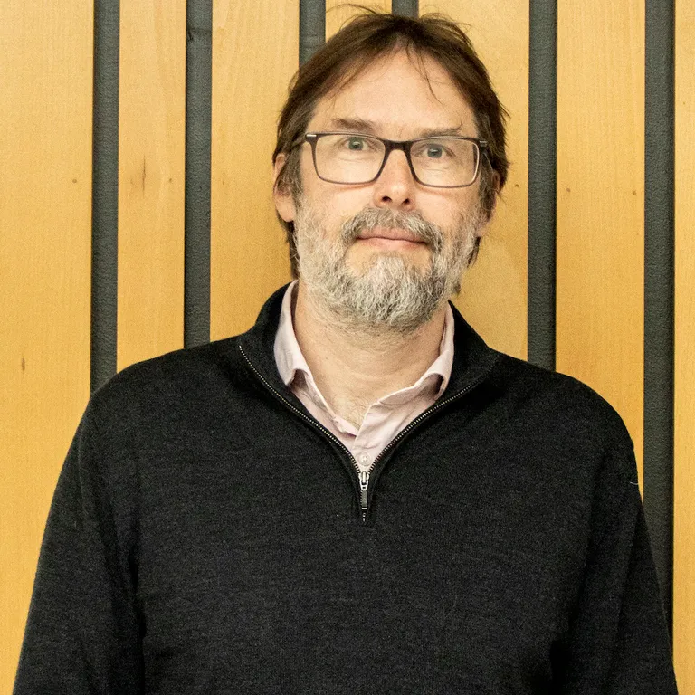
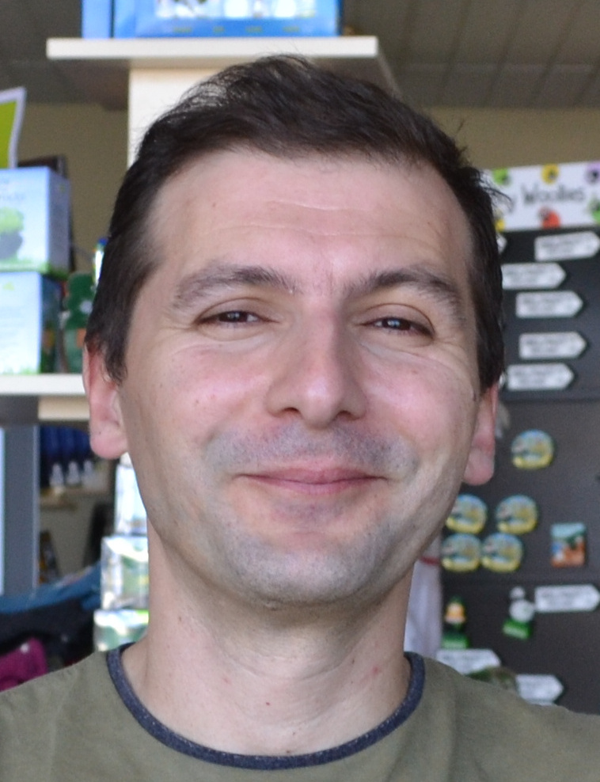
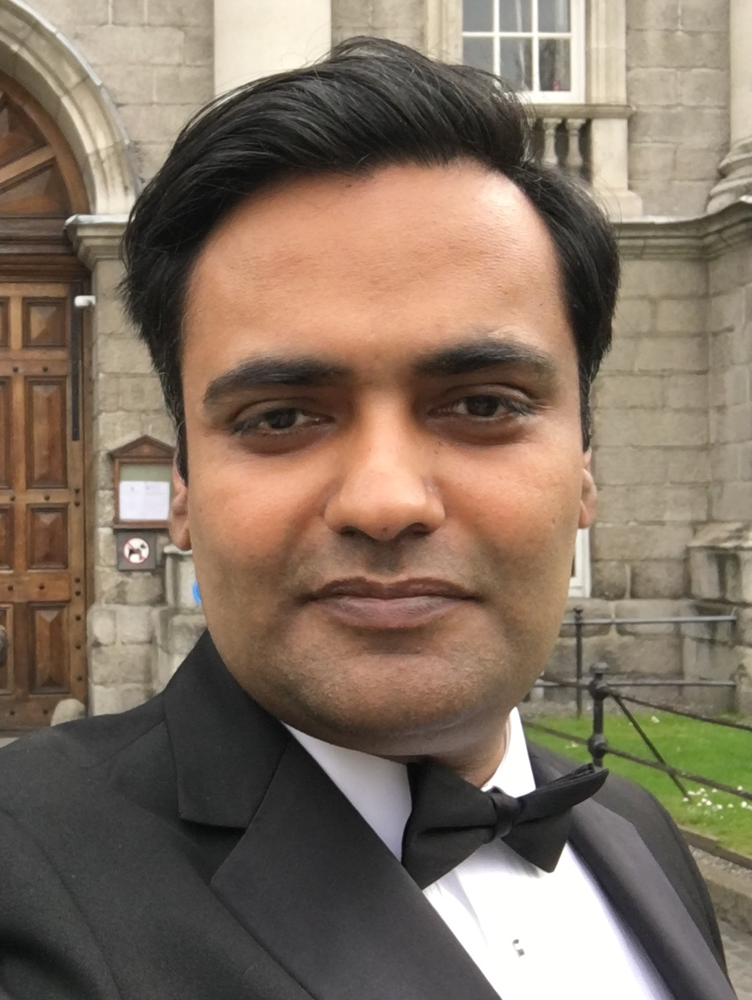

| <!-- -->    | <!-- -->    |
|-------------|-------------|
|          | [Heidi Christensen](https://scholar.google.co.uk/citations?user=5ccB6BcAAAAJ&hl=en) is a Professor in Computer Science at the University of Sheffield and a member of the Centre for Assistive Technology and Connected Healthcare (CATCH) at the University of Sheffield. I am part of the Speech and Hearing Research Group (SPandH) and a theme lead for the UKRI Centre for Doctoral Training in speech and language technologies and their applications. She am the technical lead for CognoSpeak™, a speech-based tool for detecting and tracking early signs of cognitive impairment. She has a long-standing interest in improving equality and diversity and I take an active interest in the EDI work within our university. Wider, I am on the diversity committee of ISCA (International Speech Communication Association) and the Diversity and Inclusion chair for Interspeech 2023. Her research interests are in the application of audio and speech technology to the healthcare domain and include three main areas: the automatic recognition of disordered, atypical speech,
the detection and tracking of verbal and non-verbal traits in speech and language, Equality, diversity and inclusion issues in speech technology research and applications.      |
|          | **Simon Bell**, University of Sheffield         |
|          | Dr [Daniel Blackburn](https://scholar.google.co.uk/citations?user=WbGA3voAAAAJ&hl=en) is a Senior lecturer and honorary consultant neurologist at Sheffield Institute for Translational Neuroscience. His research interests are into non-invasive diagnostic tests for early dementia or cognitive impairment using electroencephalography (EEG) and conversation analysis. He has helped co-create a tool (CognoSpeakTM) that asks questions using a ‘talking head’ on a laptop, tablet or smartphone and carefully analyses the answers to detect a decline in cognitive health including very early signs of dementia in speech patterns. Language impairments occur early in Alzheimer’s disease but can be easily missed by non-expert clinicians. Daniel is interested in the features that can be detected during normal interaction. He worked on a study investigating this with linguist assessments of audio and video recordings from memory clinics. In order to make this a scalable and cost-effective solution, Daniel has co-created an automated system; CognoSpeakTM. It is consistent and patients can do the test at home.
         |
|          | **Dorota Braun**, University of Sheffield        |
|          | **Hend Elghazaly**, University of Sheffield         |
|          | **Caitlin Illingworth**, University of Sheffield         |
|          | **Ronan O’Malley**, University of Sheffield         |
|          | **Madhurananda Pahar**, University of Sheffield         |
|          | **Fritz Peters**, University of Sheffield         |
|          | **Fuxiang Tao**, University of Sheffield         |
|           | [Saturnino Luz](https://scholar.google.com/citations?user=R2C9R8oAAAAJ&hl=en) is a Reader at the Usher Institute, University of Edinburgh's Medical School. He works in medical informatics, devising and applying machine learning, signal processing and natural language processing methods in the study of behaviour and communication in healthcare contexts. His main research interest is the computational modelling of behavioural and biological changes caused by neurodegenerative diseases, with focus on the analysis of vocal and linguistic signals in Alzheimers's disease.        |
|          | [Fasih Haider](https://scholar.google.com/citations?user=9xYJHP8AAAAJ&hl=en)  is a Research Fellow at Usher Institute, University of Edinburgh's Medical School, UK. His areas of interest are Social Signal Processing and Artificial Intelligence. Before joining the Usher Institute, he was a Research Engineer at the ADAPT Centre where he worked on methods of Social Signal Processing for video intelligence. He holds a PhD in Computer Science from Trinity College Dublin, Ireland. Currently, he is investigating the use of social signal processing and machine learning for monitoring cognitive health.         |

